= Отчет по 1 работе 

== Задание 1: 

Нужно создать свой проект, подключить файл, скаченный с вашего репозитория, создать папки и структуру проекта в программе IAR, настроить STACK, HEAP, скопировать содержимое папки преподавателя в свою папку и написать программу. Для создания проекта нужно установить и открыть программу _IAR Embedded Workbench_ Далее тыкнуть на Progect > Create New Progect

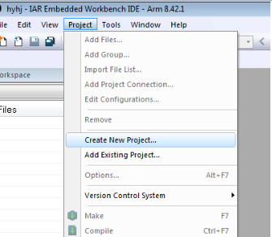 
Рисунок 1 - Создание нового проекта

Далее выбираем Язык С++ и глобальную функцию _main_

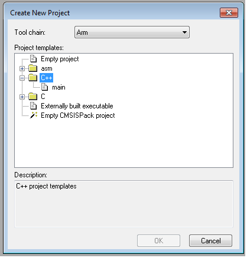 
Рисунок 2 - Выбор языка программирования и глобальной функции main

После создания проекта следует выбрать микроконтроллер (в нашем случае это ST STM32F411RE)

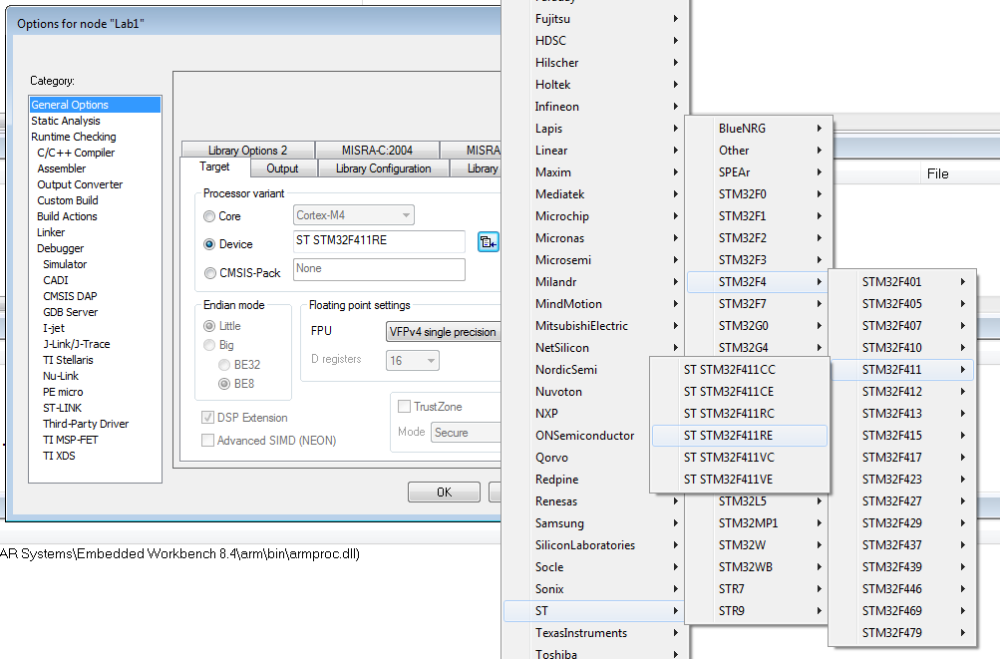 
Рисунок 3 - Выбор микроконтроллера

Теперь проект выглядит так:

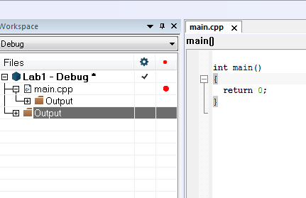

Рисунок 4 – Вид созданного проекта

Далее нужно было скопировать папку преподавателя с помощи командной строки, которая вызывается кнопками Win+R в определённую папку.

Далее следует добавление файл cstartup.cpp. в наш проект, воспользовавшись Add -> Add Files

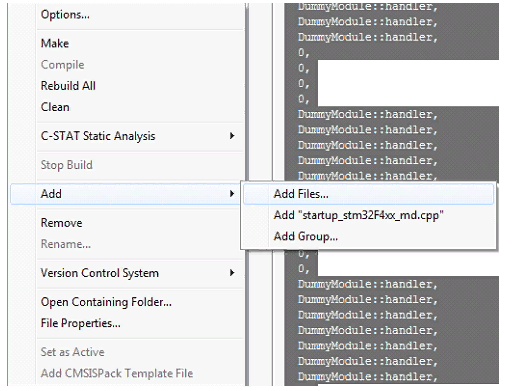 
Рисунок 5 - Добавление файла 

Далее создадим папки AbstractHardware/Registers/FiledValues, Common, Application, FreeRtos, это делаем в ручную, либо же скопировав их точно так же, как это было в файле, через командную строку. Структуру проекта создаём в соответствии со структурой папок. Структура нашего проекта должна получиться вот такой: 

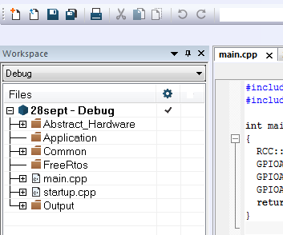 
Рисунок 6 - Изменение структуры проекта

Для включения STACK, HEAP необходимо поставить галочку в меню Options -> Linker-> Advansed -> Enable stack usage analysis

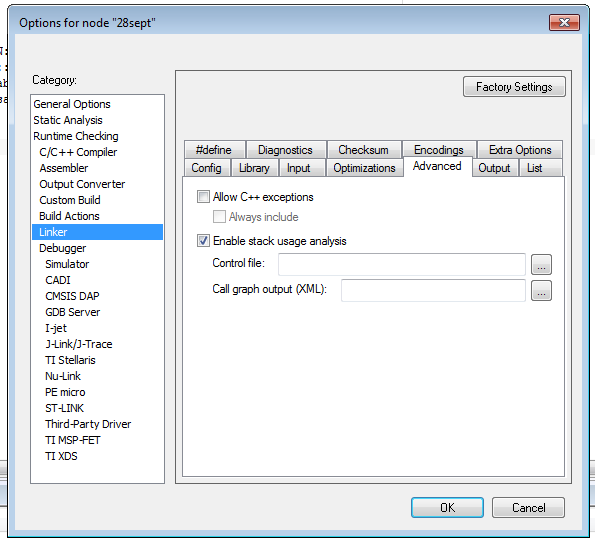 
Рисунок 7 - Изменение структуры проекта

Ну и по этому заданию осталось лишь написать программу.

Она взята из примера программы преподавателя 

----
#include "gpiocregisters.hpp" //for GPIOC 
#include "rccregisters.hpp" //for RCC int main() 
{ 
RCC::AHB1ENR::GPIOCEN::Enable::Set() ;
GPIOC::MODER::MODER5::Output::Set() ;
GPIOC::ODR::ODR5::Enable::Set() ; 
GPIOC::ODR::ODR5::Disable::Set() ; 
return 0 ; 
}
----

== Задание 2

В задании два необходимо: откомпилировать программу, загрузить её в симулятор, сделать пошаговую отладку (и исправить ошибки, если есть), подключить плату к компьютеру, загрузить программу в плату, выполнить пошаговую отладку и посмотреть что будет При первой компиляции столкнулись с ошибками, надо было заменить GPIOC на GPIOA, и в файлах gpiocfieldvalues.hpp и rccfieldvalues.hpp значения регистра ODR5 были прописаны как Value1, Value0, а не Enable, Outputy.

Это всё меняем и компелируем заново, ошибок нет

Настроить Debugger на отладку через StLink

Для настройки идем в Project=>Options…=>ST-LINK и выбираем параметры Следующим шагом было прошить микроконтроллер и загрузить программу, для этого надо настроить Debugger на отладку через StLink . Для настройки идем в Project=>Options…=>ST-LINK и выбираем параметры Далее подключаем плату к компьютеру При скачивании IAR должны быть установлены все необходимые драйвера, в противном случае программа не увидит плату

Загрузить программу в плату

Выполнить пошаговую отладку клавишей *F10*.

Код программы с построчным описанием: 

----
#include "gpiocregisters.hpp" //for GPIOC 
#include "rccregisters.hpp" //for RCC 
int main() //глобальная функция 
//тело функции 
{ 
RCC::AHB1ENR::GPIOCEN::Enable::Set() ; //разрешение тактирования порта С 
GPIOC::MODER::MODER5::Output::Set() ; //РС 5 - выход 
GPIOC::ODR::ODR5::Enable::Set() ; //включение диода РС 5
GPIOC::ODR::ODR5::Disable::Set() ; //выключение диода PC 5 
return 0 ; //конец выполнения программы 
} 
---- 

== Задание 3

В задании нужно узнать рекомендуемый размер стека (мы выставили галочку для настройки ещё в задании 1), изменить стек на рекомендуемый, поставить размер кучи в 0 и проверить что будет. Рекомендуемый размер стека следует смотреть в файле _map_ 

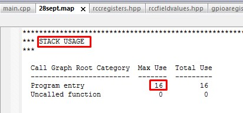 

В нашем случае рекомендуемый размер 16. В map файле пишутся размеры нашего файла, рекомендуемый размер стека.

В .map файле написаны размеры составляющих проекта.

Мы можем увидеть размер стека

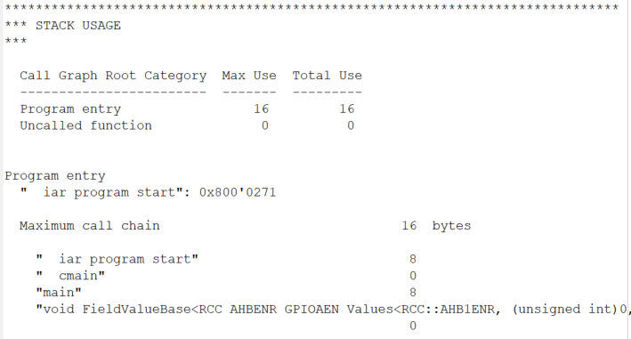 

Размер отдельных элементов:

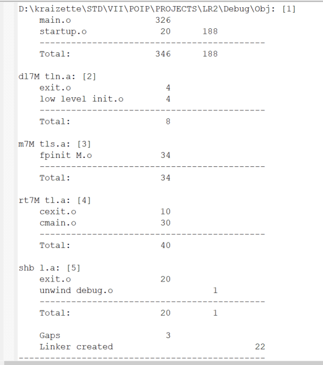 

Размер нашего файла:

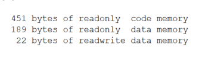 

Размер кучи HEAP можно поставить в 0, т.к. не используется динамическая память. Размер STACK нельзя поставить в 0, т.к. при использовании функций будет невозможна запись адреса возврата. Однако, в нашем случае, путем эксперимента было установлено, что даже при выставлении 0 в стеке программа запускается и диод мигает.